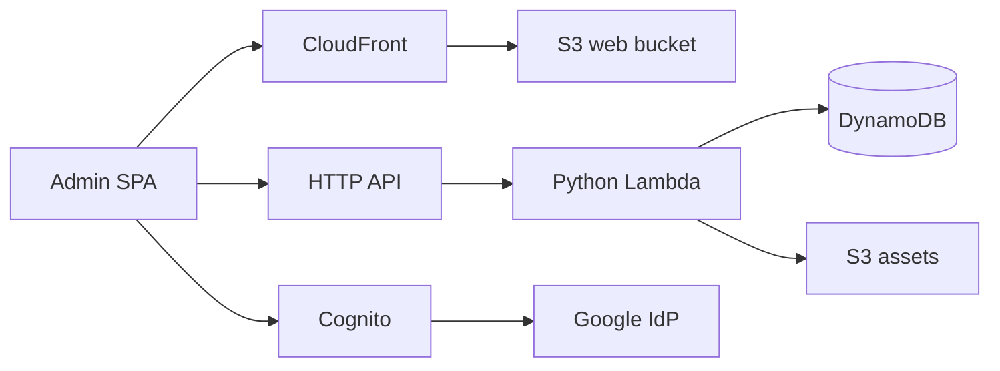
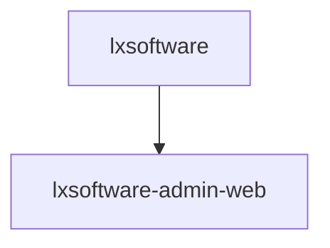

# Admin console architecture

The admin experience is a private Vite + React SPA (`apps/admin_web`) backed by
two AWS CDK stacks. Traffic flows from operators through Cloudflare DNS
(gray cloud) to CloudFront, which serves static files from private S3. API
calls go to API Gateway HTTP API with a Cognito JWT authorizer; Lambda
functions enforce the `admin` Cognito group and integrate with DynamoDB and S3.

## CDK deploy order

`lxsoftware-admin-web` reads **CSP** values from Cognito and the HTTP API
outputs in `lxsoftware`, so it must deploy **after** `lxsoftware`:

## Stacks

The repository ships **three** CDK stacks. The admin backend lives in a single
consolidated stack rather than the previous five-stack split.

| Stack                     | Purpose                                                                                  |
|---------------------------|------------------------------------------------------------------------------------------|
| `lxsoftware-public-www`   | Public marketing site: S3 origin + CloudFront.                                           |
| `lxsoftware`              | Admin backend: Cognito + Pre Token Generation Lambda, DynamoDB tables, private uploads bucket, HTTP API + admin Lambda. |
| `lxsoftware-admin-web`    | Admin SPA delivery: S3 + CloudFront + WAF/CSP.                                           |

Physical resource names (DynamoDB tables `lx-admin-records` and
`lx-admin-audit-log`, the user pool `lx-admin-user-pool`, S3 buckets
`lx-admin-assets-*`, `lx-admin-web-*`, etc.) are kept stable across the
consolidation so existing data is preserved on import.
