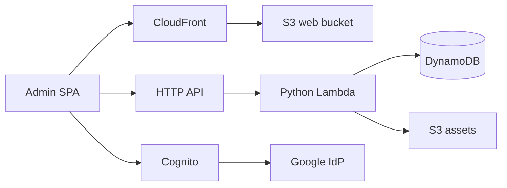
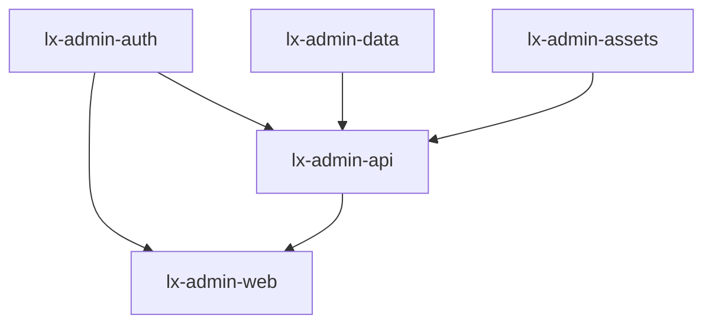

# Admin console architecture

The admin experience is a private Vite + React SPA (`apps/admin_web`) backed by
dedicated AWS CDK stacks. Traffic flows from operators through Cloudflare DNS
(gray cloud) to CloudFront, which serves static files from private S3. API
calls go to API Gateway HTTP API with a Cognito JWT authorizer; Lambda
functions enforce the `admin` Cognito group and integrate with DynamoDB and S3.

## CDK deploy order

`lx-admin-web` reads **CSP** values from Cognito and the HTTP API outputs, so it
must deploy **after** `lx-admin-auth` and `lx-admin-api`. A safe order is:

`lx-admin-data` and `lx-admin-assets` have no dependency on auth and can deploy
in parallel with it; `lx-admin-api` depends on auth (JWT issuer), data, and
assets buckets/tables.

## Stacks

| Stack             | Purpose                                      |
|-------------------|----------------------------------------------|
| `lx-admin-auth`   | Cognito user pool, Google federation, MFA, Pre Token Generation |
| `lx-admin-data`   | `lx-admin-records` and `lx-admin-audit-log` |
| `lx-admin-assets` | Private uploads bucket with CORS for SPA   |
| `lx-admin-api`    | HTTP API, JWT authorizer, Python Lambdas     |
| `lx-admin-web`    | S3 + CloudFront for the SPA                  |

The public marketing site (`lxsoftware-public-www`) is unchanged and deploys
independently.
