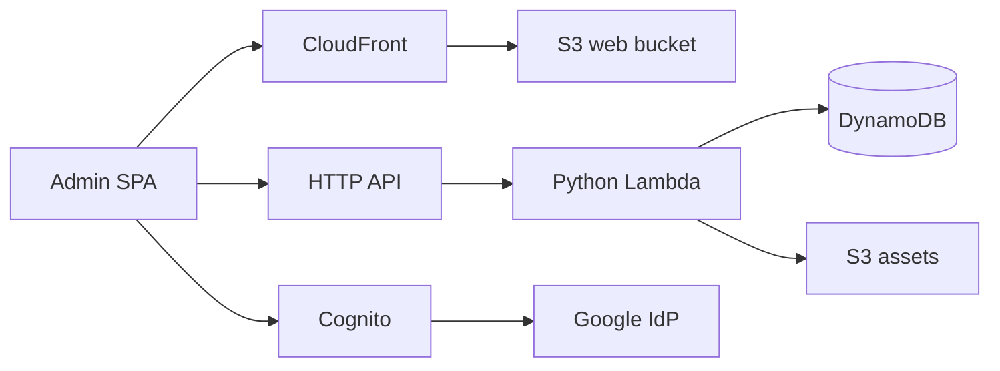
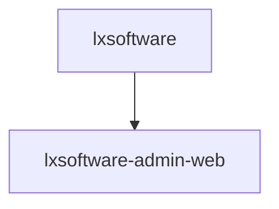

# Admin console architecture

The admin experience is a private Vite + React SPA (`apps/admin_web`) backed by
two AWS CDK stacks. Traffic flows from operators through Cloudflare DNS
(gray cloud) to CloudFront, which serves static files from private S3. API
calls go to API Gateway HTTP API with a Cognito JWT authorizer; Lambda
functions enforce the `admin` Cognito group and integrate with DynamoDB and S3.

## CDK deploy order

`lxsoftware-admin-web` still **depends on** `lxsoftware` for the HTTP API URL
used in CSP (`connect-src`). The Cognito OAuth origin is set with the
`CspCognitoConnectOrigin` parameter (see `params/production.json`), not a
cross-stack export, so `lxsoftware` can change Cognito domain resources without
blocking on stale CloudFormation exports.

The **Deploy Backend** workflow runs a **short `lxsoftware-admin-web`-only**
deploy first when using `CDK_PARAM_FILE`, then deploys `lxsoftware` and
`lxsoftware-admin-web` together so Cognito template updates do not fail on
export deletion while an older admin template still imports the removed export.

## Stacks

The repository ships **three** CDK stacks. The admin backend lives in a single
consolidated stack rather than the previous five-stack split.

| Stack                     | Purpose                                                                                  |
|---------------------------|------------------------------------------------------------------------------------------|
| `lxsoftware-public-www`   | Public marketing site: S3 origin + CloudFront.                                           |
| `lxsoftware`              | Admin backend: Cognito + Pre Token Generation Lambda, DynamoDB tables, private uploads bucket, HTTP API + admin Lambda. |
| `lxsoftware-admin-web`    | Admin SPA delivery: S3 + CloudFront + WAF/CSP.                                           |

All physical resource names use the `lxsoftware-admin-*` prefix
(DynamoDB tables `lxsoftware-admin-records` and
`lxsoftware-admin-audit-log`, the user pool `lxsoftware-admin-user-pool`,
S3 buckets `lxsoftware-admin-assets-*`, `lxsoftware-admin-assets-logs-*`,
`lxsoftware-admin-web-*`, `lxsoftware-admin-web-logs-*`, the HTTP API
`lxsoftware-admin-api`, and the Cognito hosted UI prefix
`lxsoftware-admin-auth`).
